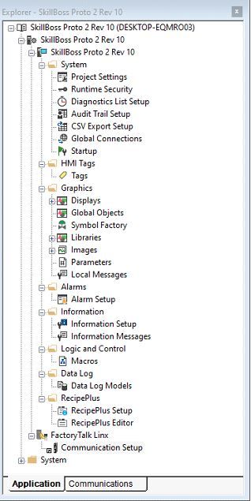

How to get the source of Skill Boss Logistics.mer:\
⦁	Identify where Skill Boss Logistics.mer is:

(Alternatively at C:\Users\Public\Documents\RSView Enterprise\ME\Runtime\Skill Boss Logistics.mer)

⦁	Open FactoryTalk View Studio
⦁	Go to Tools -> Application Manager. A dialog like this should pop up:

⦁	Select restore runtime application. Click next.

⦁	Specify the runtime application to restore as the file path from step 1:
⦁	Hit next and finish following the application manager prompts. The HMI should now be loaded in Factory Talk View Studio

How to run the source after modifying it:
Application => Test Application compiles and runs the application
Application => Create Runtime application creates a new modified runtime application

How to fix the dimensions of the app to match screen size:

1. Click on project settings

2. General => Custom Size => monitor size => click OK and follow through the barrage of prompts that appear. 

How to fix connection issues:
* Ensure that the Amatrol ethernet is connected to the desktop via ethernet cable.
* Ensure that the IP address in network settings for the Amatrol ethernet connection is 192.168.1.10 with 24 subnet prefix and 192.168.1.1 gateway
* Double click on FactoryTalk Linx > Communication setup to open the communication settings GUI

* On design (local), ensure that the connections to 192.168.1.1 (plc), 192.168.1.2 (vfd), and 192.168.1.3 (barcode) are there.

*If you don’t see these, troubleshoot your PC’s network settings until they appear. Verify the IP address is 192.168.1.10 for the PC.
* Click “Copy from Design to Runtime” in the top right corner
* Click ME 190215_PLC on the left pane, and the controller on the right pane (192.168.1.1). Then click the apply button. It is grayed out currently because they are already linked.

* You are now connected to the PLC! Run the modified HMI and enjoy :)