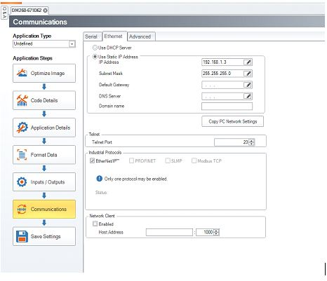
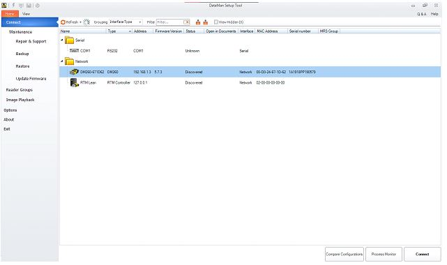

The Dataman setup tool app allows users to modify the connection settings of the barcode reader. How to download it is described in the manual.

Once opened, this device should appear:\


That is the barcode scanner. Double click on it to connect.\

 
Click on communications to view how to communicate with the scanner. Amatrol uses Telnet with the IP 192.168.1.3, subnet mask 255:255:255:0 and telnet port 23.


At this point we’re ready to send commands to the dataman.
Documentation is provided here: https://support.cognex.com/docs/dmst_631/web/EN/DMCC/Content/Topics/dmcc-main.html

Note that silent mode is enabled on the barcode reader. When trying to disable it it seems to be instantly enabled. This means that invalid commands will return nothing so it may appear like you are not connected to the reader. Don’t be deceived!

The most important command is ||>TRIGGER ON. This is used to read the package underneath the scanner. Gives no response if there is no package, or a number corresponding to the package type otherwise (i.e. 2, or 3).
||>TRIGGER ON is a very useful command for troubleshooting whether the dataman received the command or not. The barcode reader does a flashing animation that makes it very obvious when it performs a scan regardless of whether it sends a result or not.

image.png
We can send commands like this via python. Remember to encode as ascii and end all commands with \r\n:

Telnetlib:
```python
from telnetlib import Telnet
import time

tn = Telnet('192.168.1.3', 23, 2)

cmd = "||>TRIGGER ON".encode('ascii') + b'\r\n'
tn.write(cmd)
time.sleep(0.1)
read = tn.read_very_eager()
resultstring = read.decode('utf-8')
tn.close()
print("RESULT: " + resultstring)
```
NO RESPONSE MEANS IT DIDN'T FIND A BARCODE

Sockets:
```python
import socket

client = socket.socket(socket.AF_INET, socket.SOCK_STREAM)
client.connect(('192.168.1.3', 23))
client.send("||>REBOOT".encode('ascii') + b'\r\n')

response = client.recv(4096)
print(response)
```

To interface with simulink, use the Quanser stream blocks.